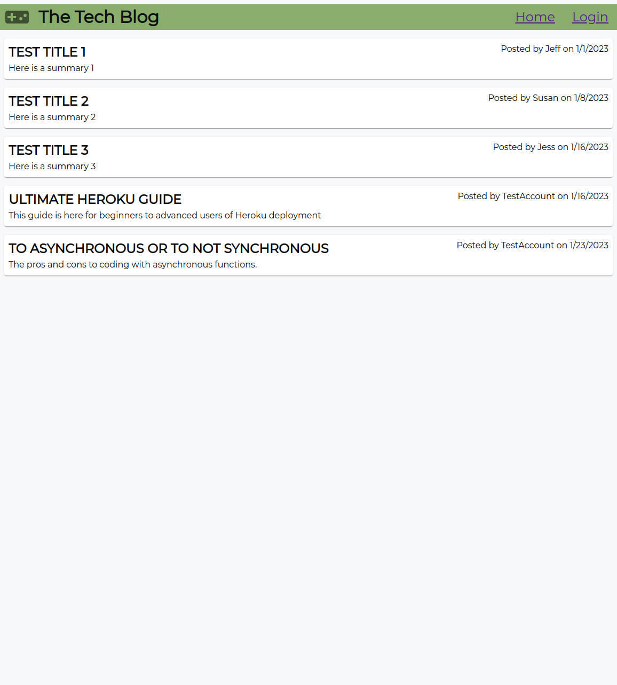

# wk14c-tech-blog

## Description

I used this project to create a place where I, and other users, could post our thoughts, tutorials, and technical information to help each other out with our mutual journey through learning to become a full-stack coder. The project was a good experience for creating full-stack applications that connect front-end and backend environments.

## Installation

The following installation steps below can be used to set up the application in a development environment.

- Install MySQL and NodeJS for your OS version
    - Configure MySQL
- Clone the repository to your local machine
- Create a '.env' file in the root directory
    - Use the database name: 'blog_db'
    - Add your MySQL user name and password
- Open a terminal to the root of the cloned repo
- Run the following command in the terminal: $ npm i
- Log into MySQL in the terminal and run the following command:
    - $ source db/schema.sql;
    - $ exit
- Run the following commands in the terminal:
    - $ npm run seed
    - $ node server.js
- Open a browser and navigate to 'localhost:3001/'

## Usage

From the homepage, you can view full posts by clicking on them. You can login or register for a new account with the 'login' link at the top right. Once your logged in, you can comment on any posts by viewing the full post. From the 'dashboard' link at the top left, you can view all your posts. You can edit your posts by clicking on it in your dashboard. From there, you can save any changes or delete the post. From the dashboard, you can add new posts as well by using the 'add-post' button.

## Credits

Used the following site to generate test text content: https://loremipsum.io/

## License

Refer to the LICENSE in the repo for the code. 
The font (Montserrat) is licensed under the SIL Open Font License (OFL).
